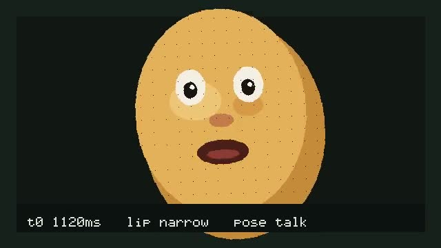

# realtime-avatar-tap

Synchronous in-memory path from PCM chunks to timed lip and pose blocks. Four functions. No live media.

Source itch: Sidney Primas and LemonSlice, [Voice agents with Realtime Video](https://www.youtube.com/watch?v=z1dqv74SpUs) (AI Engineer). This package stops at the ingest and emit loop.

## Four primitives

1. **`openSession({ audioIn, videoOut })`.** Returns an opaque session. `audioIn` and `videoOut` are logical labels. An empty or whitespace-only label throws, and the error names the field.

2. **`ingestAudioChunk(session, pcm)`.** Appends signed 16-bit mono PCM onto the session ring. An empty chunk is a no-op. A drop is skipping this call.

3. **`emitAvatarBlock(session)`.** Reads the last 40 ms window, pads missing samples with silence, looks up lip and pose from window RMS, and advances the video clock by 40 ms. The same session still emits after a skipped ingest.

4. **`assertContinuous()`.** Opens one session with labels `mic` and `avatar`, ingests one full window, emits, skips the next ingest, and emits again. Throws `ContinuityError` if the second emit throws or the clock does not advance.

## Local demo

`npm run demo` serves the canvas potato and, when `OPENAI_API_KEY` is set, a GPT-Live conversation.

Tater speaks **replies**. Caller audio is not ingested. Reply PCM goes through `ingestAudioChunk` / `emitAvatarBlock`.

Voice model: `gpt-live-1` (OpenAI's live speech model, 16 kHz PCM over a server WebSocket). Reasoning backend: `gpt-5.6-terra`. Not GPT-4o.

```sh
npm install
npm run demo
```

Open http://127.0.0.1:4173. **Play fixture** sends `speech-fixture.wav` as user audio and plays Tater's reply (needs the key; works without a mic). **Use mic**, then **Stop**, to send a live turn. Mic needs localhost or HTTPS. `fixture.wav` is still the synthetic RMS ladder for tap tests.

Keep the key on the Cloud Agent environment as runtime secret `OPENAI_API_KEY`. Do not commit it. Local override: `.env.local` (gitignored) is not read automatically; export the variable in the shell that runs `npm run demo`.

Recorded artifact from the pre-conversation puppet path:

- [`artifacts/potato-avatar-demo.mp4`](artifacts/potato-avatar-demo.mp4)
- Poster: [`artifacts/potato-avatar-demo.jpg`](artifacts/potato-avatar-demo.jpg)



Regenerate the fixture WAV or the puppet recording with `npm run demo:fixture` and `npm run demo:record`. Track status in [ROADMAP.md](ROADMAP.md).

## Not in scope

A LemonSlice clone, GPU rendering, and live WebRTC.

## Run

Needs Node 22.6 or newer.

```sh
npm install
npm test
```

`npm test` builds `dist/` then runs `node --experimental-strip-types --test src/*.test.ts demo/*.test.js`. Consumers import compiled JS from `dist/` (`main` / `exports`), not TypeScript source.
