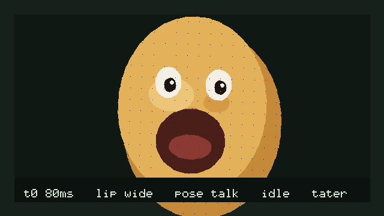
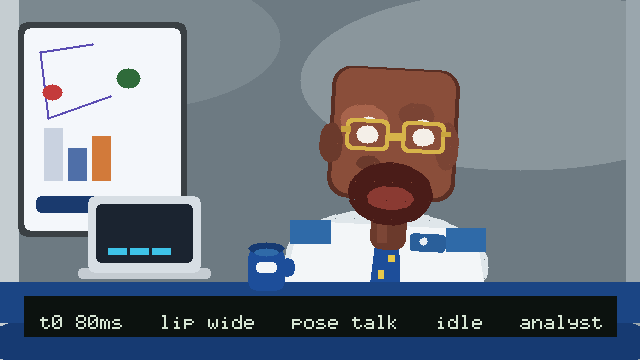
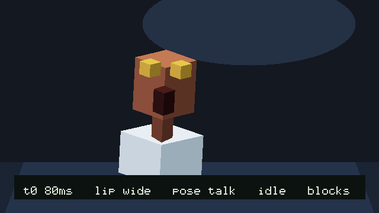
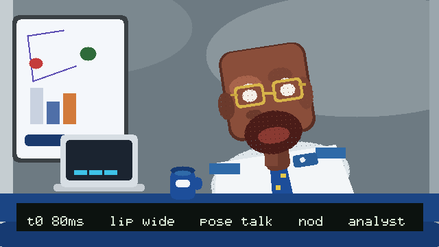
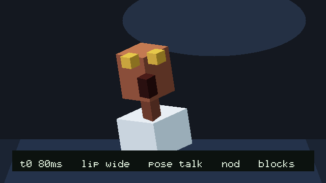
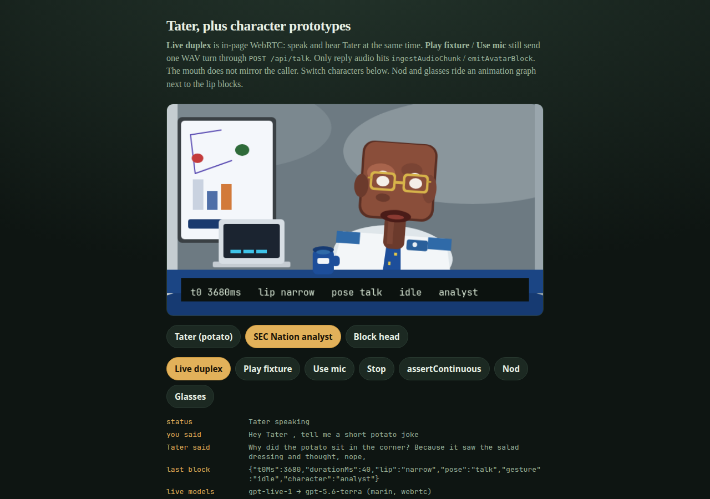

# realtime-avatar-tap

Synchronous in-memory path from PCM chunks to timed lip and pose blocks. Four functions.

Source itch: Sidney Primas and LemonSlice, [Voice agents with Realtime Video](https://www.youtube.com/watch?v=z1dqv74SpUs) (AI Engineer). This package stops at the ingest and emit loop.

## Four primitives

1. **`openSession({ audioIn, videoOut })`.** Returns an opaque session. `audioIn` and `videoOut` are logical labels. An empty or whitespace-only label throws, and the error names the field.

2. **`ingestAudioChunk(session, pcm)`.** Appends signed 16-bit mono PCM onto the session ring. An empty chunk is a no-op. A drop is skipping this call.

3. **`emitAvatarBlock(session)`.** Reads the last 40 ms window, pads missing samples with silence, looks up lip and pose from window RMS, and advances the video clock by 40 ms. The same session still emits after a skipped ingest.

4. **`assertContinuous()`.** Opens one session with labels `mic` and `avatar`, ingests one full window, emits, skips the next ingest, and emits again. Throws `ContinuityError` if the second emit throws or the clock does not advance.

## Local demo

`npm run demo` serves the canvas avatar and, when `OPENAI_API_KEY` is set, a GPT-Live conversation.

Switch character with the row of buttons, or open a query:

```
http://127.0.0.1:4173/?character=analyst
http://127.0.0.1:4173/?character=blocks
http://127.0.0.1:4173/?character=tater
```

`analyst` is a 2D studio talking head aimed at the SEC Nation reference (square head, long neck, gold glasses, desk). `blocks` is a faceted isometric head. `tater` is the original potato.

Nod and Glasses fire an animation graph overlay. The mouth still follows **reply** audio only. Caller audio is not ingested. Reply PCM goes through `ingestAudioChunk` / `emitAvatarBlock`. See [docs/character-prototypes.md](docs/character-prototypes.md).

Two conversation paths:

- **Live duplex** — browser WebRTC to GPT-Live. Mic audio and Tater's voice travel on media tracks in the page. The server only exchanges SDP (`POST /api/session`) with the project key. Needs a microphone (localhost or HTTPS).
- **Play fixture** / **Use mic** then **Stop** — one WAV turn through `POST /api/talk` on a server WebSocket. Fixture works without a mic. Cloud agents use this hop.

The mouth follows **reply** audio only. Caller audio is not ingested. Reply PCM goes through `ingestAudioChunk` / `emitAvatarBlock`.

Voice model: `gpt-live-1`. Reasoning backend: `gpt-5.6-terra`. Voice: `marin`. Env overrides: `OPENAI_LIVE_MODEL`, `OPENAI_LIVE_BACKEND`, `OPENAI_LIVE_VOICE`. Not GPT-4o.

```sh
npm install
npm run demo
```

Open http://127.0.0.1:4173.

Keep the key on the Cloud Agent environment as runtime secret `OPENAI_API_KEY`. Do not commit it. Do not put it in `environment.json` or the browser. Local override: `.env.local` (gitignored) is not read automatically; export the variable in the shell that runs `npm run demo`.

Recorded artifact from the pre-conversation puppet path:

- [`artifacts/potato-avatar-demo.mp4`](artifacts/potato-avatar-demo.mp4)
- Poster: [`artifacts/potato-avatar-demo.jpg`](artifacts/potato-avatar-demo.jpg)


Character prototype stills (`npm run demo:characters`):

| Tater | Analyst | Blocks |
| --- | --- | --- |
|  |  |  |

Nod overlay on the same wide viseme:

| Analyst nod | Blocks nod |
| --- | --- |
|  |  |

Browser stills of the same switcher:



Regenerate the fixture WAV or the puppet recording with `npm run demo:fixture` and `npm run demo:record`. Track status in [ROADMAP.md](ROADMAP.md).

## Not in scope

A LemonSlice product clone and GPU rendering. Reply-driven recorded demo artifact is Later.

## Run

Needs Node 22.6 or newer.

```sh
npm install
npm test
```

`npm test` builds `dist/` then runs `node --experimental-strip-types --test src/*.test.ts demo/*.test.js`. Consumers import compiled JS from `dist/` (`main` / `exports`), not TypeScript source.
